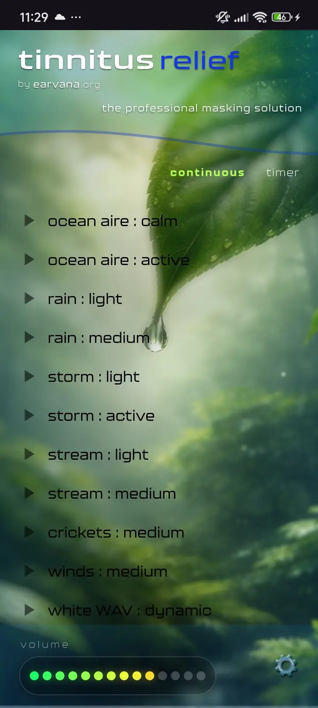
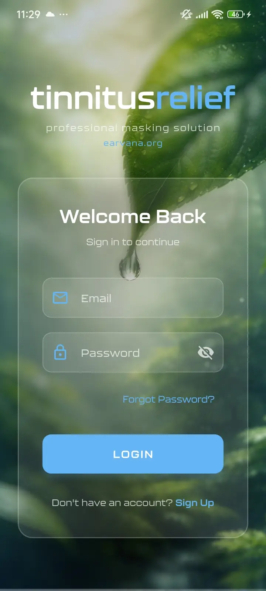
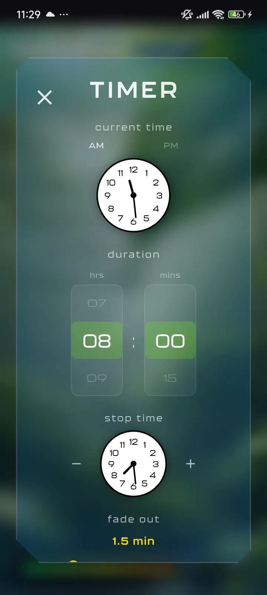
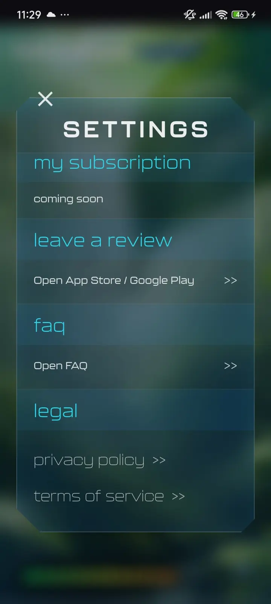

# Tinnitus Relief App 🎧🌿

A professional Flutter-based sound masking and relaxation application designed to relieve tinnitus symptoms. Features 12 high-quality sound therapy tracks, customizable timer & fade controls, vertical volume shaping, and a modern glassmorphism interface.

---

## 📱 App Screenshots

| Sound Therapy Player | Auth Flow | Advanced Timer Modal | Settings & Legal |
| :---: | :---: | :---: | :---: |
|  |  |  |  |
| **Masking Player** | **Authentication** | **Timer & Fade** | **Settings & FAQ** |

---

## ✨ Features

- **🔊 12 Bundled Sound Masking Tracks**:
  - *Ocean Aire*: Calm, Active
  - *Rain*: Light, Medium
  - *Storm*: Light, Active
  - *Stream*: Light, Medium
  - *Nature*: Crickets, Winds
  - *Noise*: White WAV Dynamic
- **🎛️ Dynamic Playback & Volume Control**:
  - Interactive track selection with play/pause visual states (green for playing, animated yellow for paused).
  - Vertical dot-based volume level meter with smooth intensity adjustment.
  - Manual track list scroll controls (`top` / `more`) and fluid gesture touch scrolling.
- **⏱️ Advanced Session Timer & Audio Fade-Out**:
  - Quick duration slider for continuous playback ($\infty$) or finite timer (`1-10` hours).
  - Custom `TimerModal` with real-time analog clock displays, custom hour/minute pickers, and configurable audio fade-out durations (e.g., 1.5 min).
- **🔐 User Authentication**:
  - Clean glassmorphism auth screens including Login, Sign Up, and Forgot Password flows.
- **⚙️ Settings & Legal Portal**:
  - Integrated settings drawer linking to FAQ, Privacy Policy, Terms of Service, and App Store / Google Play review destinations.

---

## 🛠️ Tech Stack

### **Framework & Core**
- **[Flutter SDK](https://flutter.dev/)** (`^3.10.7`) & **[Dart](https://dart.dev/)**
- **[AudioPlayers](https://pub.dev/packages/audioplayers)** (`^6.0.0`) - High-performance audio playback & looping system
- **[URL Launcher](https://pub.dev/packages/url_launcher)** (`^6.3.1`) - External link handling for FAQs and store pages
- **[Cupertino Icons](https://pub.dev/packages/cupertino_icons)** (`^1.0.8`) - iOS-style icons

### **UI & Styling**
- Custom **Kallisto** typography family (Thin, Light, Medium, Bold, Heavy weights)
- Custom Canvas Painters (`CustomPainter`) for glassmorphism panels, volume meters, and chamfered edges
- Responsive layout components

---

## 📁 Project Structure

```
tinnitus_relief_app/
├── assets/
│   ├── audio/                 # 12 bundled masking WAV/MP3 tracks
│   ├── fonts/                 # Kallisto font weight definitions
│   ├── images/                # Background graphics & brand icons
│   └── screenshots/           # App screenshot showcase for README
├── lib/
│   ├── main.dart              # Application entry point & theme configuration
│   ├── screens/
│   │   ├── home_screen.dart   # Main sound player UI & playback state management
│   │   ├── login_screen.dart  # Authentication login screen
│   │   ├── signup_screen.dart # User registration screen
│   │   └── forgot_password_screen.dart # Password reset flow
│   └── widgets/
│       ├── home_screen_header.dart  # Branding header component
│       ├── track_list_widget.dart   # Masking audio track list
│       ├── volume_bar.dart          # Vertical volume shaping bar
│       ├── dot_volume_meter.dart    # LED-style volume indicator
│       ├── bottom_bar.dart          # Main bottom navigation & timer bar
│       ├── timer_modal.dart         # Analog clock & duration picker modal
│       └── settings_modal.dart      # Subscription, FAQ, & legal options
├── legal/                     # Store deployment legal drafts & privacy policies
├── android/                   # Native Android project configuration
└── ios/                       # Native iOS project configuration
```

---

## 🚀 Getting Started

### Prerequisites

Ensure you have the Flutter SDK installed and configured on your machine:
```bash
flutter doctor
```

### Installation & Run

1. **Clone the repository**:
   ```bash
   git clone https://github.com/your-username/tinnitus_relief_app.git
   cd tinnitus_relief_app
   ```

2. **Install dependencies**:
   ```bash
   flutter pub get
   ```

3. **Run on connected device or emulator**:
   ```bash
   # Run on default connected device
   flutter run

   # Run specifically on iOS simulator or Android emulator
   flutter run -d ios
   flutter run -d android
   ```

---

## 📜 Legal & Store Readiness

Draft legal documentation is located under the [`legal/`](file:///C:/Users/mdnab/Desktop/tinnitus_relief_app/legal/) directory:
- `PRIVACY_POLICY.md`
- `TERMS_AND_CONDITIONS.md`
- `APP_STORE_CHECKLIST.md`

---

## 📄 License

### 🚫 Creative Commons Non-Commercial (CC BY-NC 4.0)

This project is licensed under the **Creative Commons Attribution-NonCommercial 4.0 International (CC BY-NC 4.0)** license.

See the full [LICENSE](LICENSE) file for complete terms. You are free to share and adapt this work for non-commercial purposes as long as appropriate attribution and credit is provided to the author.
